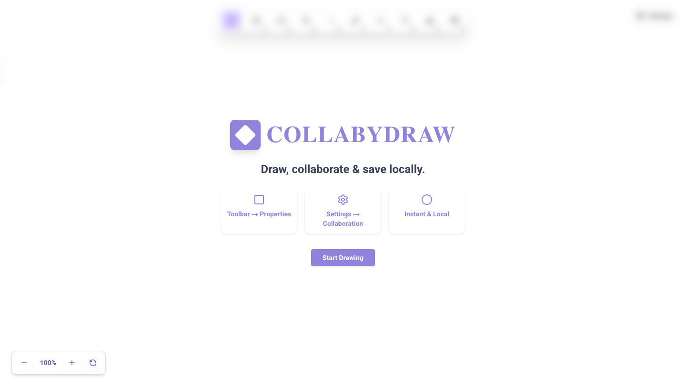
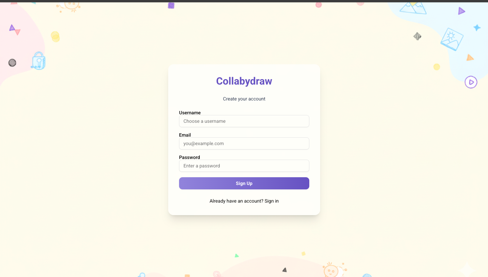
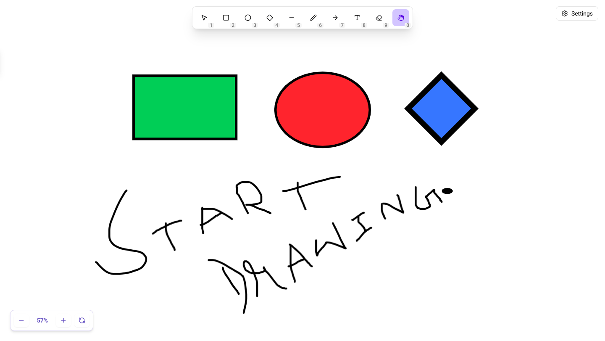
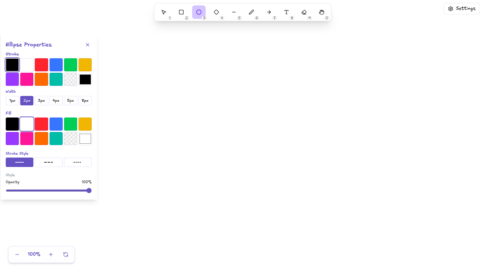
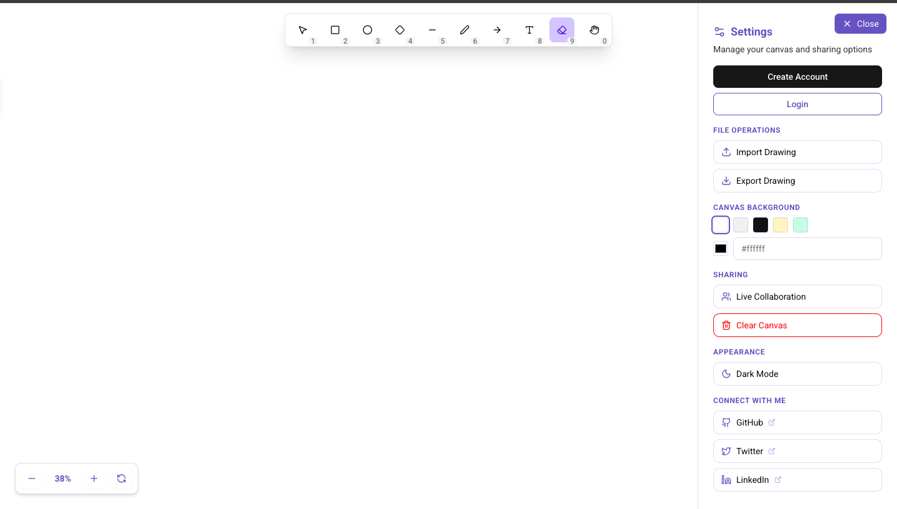
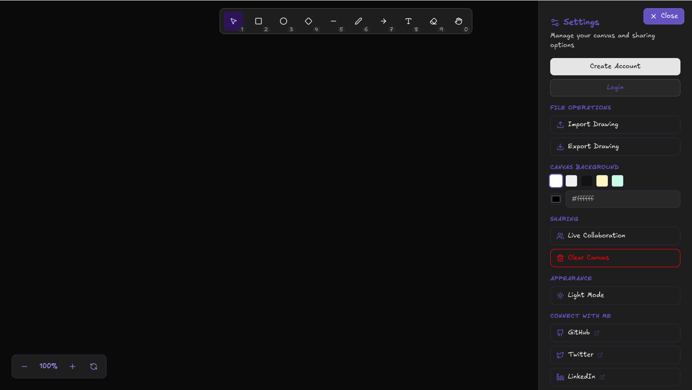

# ✏️ Collabydraw – Real-Time Collaborative Whiteboard

Collabydraw is a modern **real-time collaborative whiteboard** designed for **teamwork, brainstorming, and diagram sketching**. With a **hand-drawn feel** powered by Fabric.js, it’s perfect for remote teams to visualize ideas together.

**🌐 Live Demo:** [Access Collabydraw](https://collabydraw.adarshsingh.xyz/)  

## ✅ Core Features

- 🎨 **Whiteboard Drawing Tools** – Freehand sketching, shapes, and annotations with Fabric.js.
- 🤝 **Real-Time Collaboration** – Multiple users drawing together via WebSockets.
- 📡 **Live Sync** – Instant updates for all participants in a shared room.
- 🛡 **Secure Rooms** – JWT authentication for protected collaboration spaces.
- 🔄 **Turborepo Monorepo Setup** – Unified frontend & backend workflow.
- 🖼 **Wireframing & Diagrams** – Perfect for brainstorming sessions and design planning.
- ⚡ **Fast & Lightweight** – Optimized with Zustand for state management.
- 💾 **Local Storage Support** – Auto-save whiteboard data in browser storage.

---

## 🛠 Tech Stack

### **Client (Frontend)**

- ⚛️ **Next.js** – React-based framework for server-side rendering and dynamic client-side interactivity
- 🖌 **Fabric.js** – Canvas rendering & drawing utilities
- 🎨 **TailwindCSS, Lucide Icons, Shadcn UI, Animate.css**
- 📝 **React Hook Form & Yup** – Form handling and validation
- 🔄 **Zustand** – Efficient state management
- 🌐 **Axios** – API requests and data fetching
- 🔔 **Sonner & Tailwind Merge** – Notifications and utility helpers

### **Server (Backend)**

- ⚡ **Express.js** – Lightweight and flexible Node.js backend framework
- 🌐 **ws (WebSockets)** – Real-time communication layer
- 🗄 **PostgreSQL + Prisma ORM** – Relational database with schema management
- 🛡 **Zod, Body-Parser, CORS** – Request validation, parsing, and security
- 🌱 **Dotenv** – Environment variable management

### **📦 Monorepo**

- Frontend (`web`) and Backend (`api`) are managed in a single monorepo with **shared configurations, consistent types, streamlined development workflow, Express-powered API, and WebSocket support for real-time communication**

## Environment Variables

To run this project, you will need to set the following environment variables in your `.env` file:

- `DATABASE_URL`
- `DIRECT_URL`
- `PORT`
- `JWT_SECRET`
- `NEXT_PUBLIC_API_URL`
- `NEXT_PUBLIC_WS_URL`

## 🚀 Installation & Running Locally

Follow these steps to set up and run **Collabydraw**:

```bash
# Clone the repository
git clone https://github.com/devadarshh/collabydraw.git

cd collabydraw

# Install dependencies
pnpm install

# Run both frontend & backend with Turborepo
pnpm dev

```

--

## 📸 Screenshots

### Landing Page



### Sign In Page



### Canvas



### Shapes Page



### Settings Page



### Dark Mode Page



## 📄 License

This project is licensed under a **Custom Personal Use License** — you may view and learn from the code, but **commercial use, redistribution, or claiming authorship is strictly prohibited**.
See the full [LICENSE](./LICENSE) for details.
